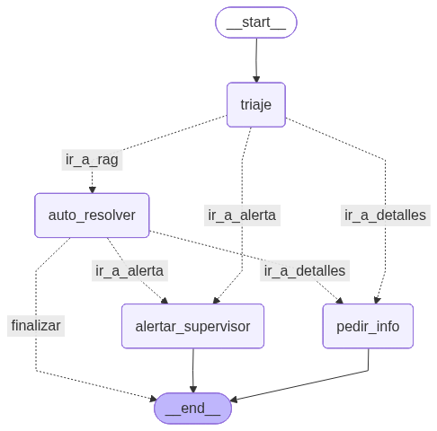

# 🤖 Agente Inteligente de Operaciones y Control Industrial (OCI)

Este repositorio contiene el desarrollo del agente de Inteligencia Artificial para el **Control de Operaciones Industriales (OCI)**. El sistema combina el poder de **LangGraph** para la orquestación de flujos de trabajo basados en estados, **LangChain** para la estructuración y recuperación de información técnica, y **Gemini 3.1 Flash-Lite** como motor principal de razonamiento con validación semántica de alucinaciones.

El asistente operativo está diseñado bajo el concepto de **Human-in-the-loop (HITL)**, proporcionando recomendaciones estructuradas basadas en documentación técnica y administrativa de la empresa, pero deteniendo el flujo para requerir la validación de un supervisor humano ante maniobras de alto riesgo en campo.

---

# 📐 Arquitectura y Flujo de Trabajo

El agente utiliza un flujo de decisiones dinámico gestionado mediante un Grafo de Estados en **LangGraph**:

```
    START([Inicio]) --> Triaje[Nodo: Triaje e Intención]
    
    Triaje -->|Decisión: AUTO_RESOLVER| RAG[Nodo: Auto Resolver RAG]
    Triaje -->|Decisión: PEDIR_INFO| Info[Nodo: Solicitar Detalles]
    Triaje -->|Decisión: ALERTAR_SUPERVISOR| Alerta[Nodo: Alerta Supervisor HITL]
    
    RAG -->|¿RAG con éxito?| Fin([Fin])
    RAG -->|¿RAG falló/alucinó con temas críticos?| Alerta
    RAG -->|¿RAG falló sin contexto crítico?| Info

```

## 🖼️ Diagrama del Flujo del Agente



## Componentes Claves de Seguridad y Precisión

1. **Bucle de Consola Interactiva:** El script incorpora un sistema interactivo `while True` nativo para consultar directamente en terminal, permitiendo una experiencia de testeo dinámica en entornos de desarrollo.
2. **Triaje Operativo Estructurado:** Evalúa de forma estricta mediante salidas de Pydantic (`with_structured_output`) la prioridad, ruta lógica y la justificación técnica del mensaje.
3. **Estrategia RAG Multilingüe con Reranking:**
   - **Embeddings:** Generados localmente con `multilingual-e5-small` usando prefijos asimétricos (`passage: ` para almacenamiento y `query: ` para consultas).
   - **Reranker:** Reclasificación local de fragmentos candidatos a través del Cross-Encoder `ms-marco-MiniLM-L-6-v2`.
4. **Guardrail Anti-Alucinaciones Integrado:** Un módulo paralelo contrasta la respuesta generada con los recursos documentales de FAISS. Se implementaron excepciones de seguridad corporativas para omitir falsos positivos en las directrices mandatorias de HSE.

---

# 📂 Estructura del Proyecto

```text
├── data/                                 # Almacén de documentación técnica de OCI
│   ├── Inventario_herramientas_EPP.pdf
│   ├── Mision_vision_y_valores_OCI.pdf
│   ├── Politica_HSE_OCI.pdf
│   ├── Procedimiento_supervisor_de_campo_OCI.pdf
│   ├── Procedimiento_y_protocolos_HSE_OCI.pdf
│   ├── Programa_intervenciones_de_pulling.pdf
│   └── Programa_mantenimiento.pdf
├── faiss_index_oci/                      # Base de datos vectorial FAISS local persistida
│   ├── index.faiss
│   └── index.pkl
├── notebooks/                            # Almacén de entornos interactivos Jupyter
│   └── Challenge_Alura_Agente_RAG_V1.ipynb
├── .gitignore                            # Configuración de exclusión de Git
├── flujo_agente_oci.png                  # Diagrama visual de estados generado
├── RAG_OCI.py                            # Script principal unificado de consola interactiva
├── README.md                             # Documentación de este repositorio
└── requirements.txt                      # Archivo de dependencias del proyecto
```

---

# 🚀 Requisitos e Instalación Local

Si vas a ejecutar el proyecto de forma local en tu computadora, sigue estos pasos:

### 1. Clonar el repositorio y configurar entorno
```bash
git clone [https://github.com/tu-usuario/tu-repositorio.git](https://github.com/tu-usuario/tu-repositorio.git)
cd tu-repositorio

# Creación de entorno virtual
python -m venv venv

# Activar entorno:
# - En Windows: venv\Scripts\activate
# - En macOS/Linux: source venv/bin/activate

# Instalar dependencias
pip install -r requirements.txt
```

### 2. Configurar las variables de entorno (.env)
Crea un archivo `.env` en la raíz del proyecto y configura tus claves:
```text
GEMINI_API_KEY="tu-api-key-de-gemini"
```

### 3. Ejecutar la Consola Interactiva
```bash
python RAG_OCI.py
```

---

# 📓 Alternativa: Ejecución en Google Colab

Este script está completamente optimizado para funcionar tanto de forma local como en la nube de **Google Colab** utilizando la ruta `notebooks/Challenge_Alura_Agente_RAG_V1.ipynb`.

### 1. Instalar dependencias
```python
!pip install -r requirements.txt
```

### 2. Configurar la API Key de forma segura
Para no exponer tu API Key, utiliza la herramienta nativa de Google Colab:
1. Abre el panel de **Secrets** (icono de llave de seguridad 🔑 en el panel de navegación izquierdo).
2. Agrega una nueva clave llamada **`Gemini-GC`**.
3. Pega tu API Key en el valor y activa la casilla **Notebook access**.

---

# 📈 Demostración de Resultados Reales (Logs de Consola)

### Test 1: Consulta Procedimental de Mantenimientos Programados
```text
Ingresa tu pregunta ---> ¿Que pozos tienen tareas de Mantenimiento estan porgramadas?
Procesando consulta...
[NODO: Triaje] Analizando riesgos de la consulta...
[NODO: Auto-Resolver] Consultando manuales técnicos...

--- RESULTADO DEL TRIAJE ---
Consulta: "¿Que pozos tienen tareas de Mantenimiento estan porgramadas?"
Categoría asignada: AUTO_RESOLVER
Urgencia priorizada: MEDIANA
Motivo técnico: Consulta informativa sobre la planificación de mantenimiento de los pozos.
Acción adoptada por el Grafo: RESOLUCIÓN_AUTOMÁTICA

--- RESPUESTA Y DIRECTRICES TÉCNICAS ---
Las tareas de mantenimiento programadas de acuerdo con el Programa de Mantenimiento de OCI son:
- Pozo E-501 (Mantenimiento Eléctrico): "Chequeo tablero" programado para el 26/06/2026.
- Pozo M-909 (Mantenimiento Eléctrico): "Medición aislamiento" programado para el 26/06/2026.
- Pozo M-707 (Mantenimiento Mecánico PCP): "Retiro cabezal (Pre-Pulling)" programado para el 27/06/2026.
- Pozo E-808 (Mantenimiento Mecánico AIB): "Reemplazo controlador" programado para el 28/06/2026.

⚠️ ADVERTENCIA DE SEGURIDAD (HSE)
Toda intervención requiere la validación en campo de los elementos de izaje y el uso estricto del EPP reglamentario.
El Supervisor de Campo tiene la decisión final frente a cualquier imprevisto técnico o climático.

--- CITACIONES DE RESPALDO (RAG) ---
  [1] Fuente: 'Programa_mantenimiento.pdf (Pág. 1)'
```

### Test 2: Consulta Específica de Fecha de Intervención (Pulling)
```text
Ingresa tu pregunta ---> ¿Cuando es la intervencion de pulling del pozo P-404?
Procesando consulta...
[NODO: Triaje] Analizando riesgos de la consulta...
[NODO: Auto-Resolver] Consultando manuales técnicos...

--- RESULTADO DEL TRIAJE ---
Consulta: "¿Cuando es la intervencion de pulling del pozo P-404?"
Categoría asignada: AUTO_RESOLVER
Urgencia priorizada: MEDIANA
Motivo técnico: Consulta de fecha del cronograma de intervenciones de pulling del pozo P-404.
Acción adoptada por el Grafo: RESOLUCIÓN_AUTOMÁTICA

--- RESPUESTA Y DIRECTRICES TÉCNICAS ---
La intervención de pulling del pozo P-404 está programada para el 26/06/2026. La tarea involucra falla de varilla y requiere el uso de Grúa Pesada, con una duración estimada de 2 a 5 días a cargo de la Cuadrilla Beta.

⚠️ ADVERTENCIA DE SEGURIDAD (HSE)
El izaje de cargas pesadas en maniobras de pulling de varillas se clasifica como operación de alto riesgo. Se debe corroborar la vigencia de la certificación del operador de grúa antes de iniciar el procedimiento.
El Supervisor de Campo tiene la decisión final frente a cualquier imprevisto técnico o climático.

--- CITACIONES DE RESPALDO (RAG) ---
  [1] Fuente: 'Programa_intervenciones_de_pulling.pdf (Pág. 1)'
```

---

# 🛠️ Tecnologías y Librerías Utilizadas

- **LangGraph**: Orquestador principal de grafos de estados y flujos conversacionales.
- **LangChain**: Conectores e integraciones modulares de LLM y cadenas documentales.
- **FAISS**: Indexación y almacenamiento de vectores en memoria local de alta velocidad.
- **HuggingFace Sentence-Transformers**: Carga local del modelo `multilingual-e5-small` y reranker `cross-encoder`.
- **Pydantic V2**: Validación estricta para garantizar respuestas estructuradas en formato JSON.
- **PyMuPDF & Unstructured**: Extracción limpia y rápida de tablas de Excel y manuales PDF.
